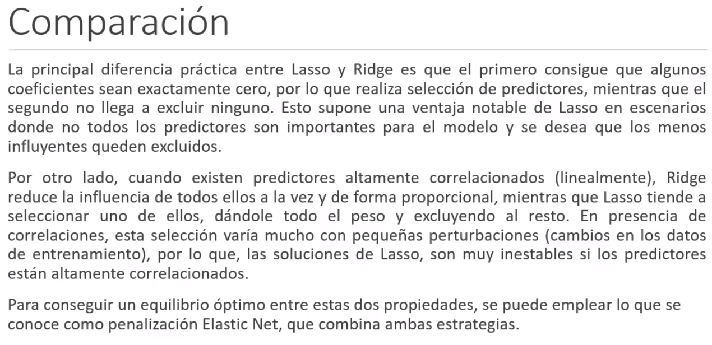
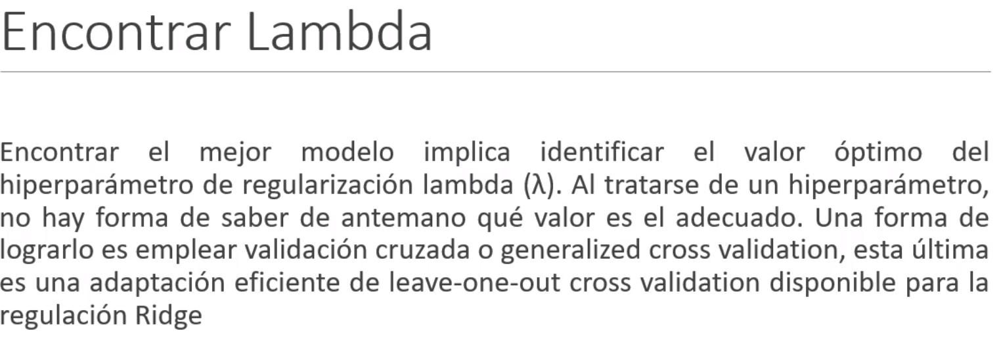
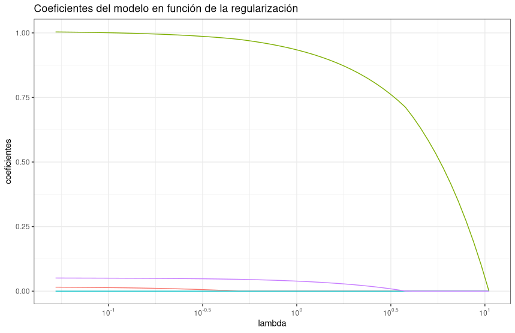
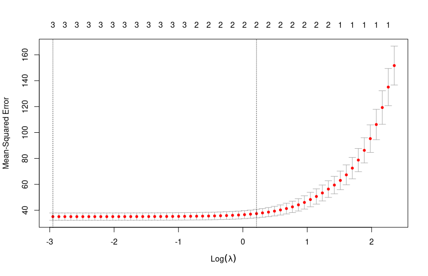
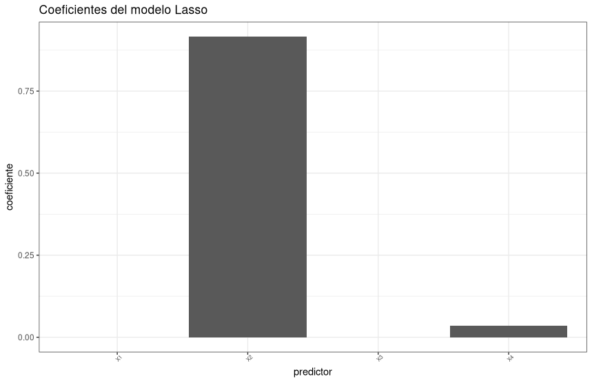
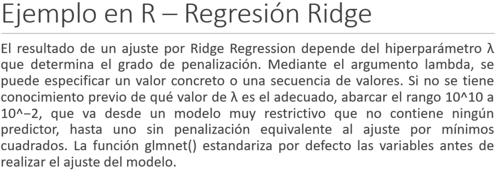
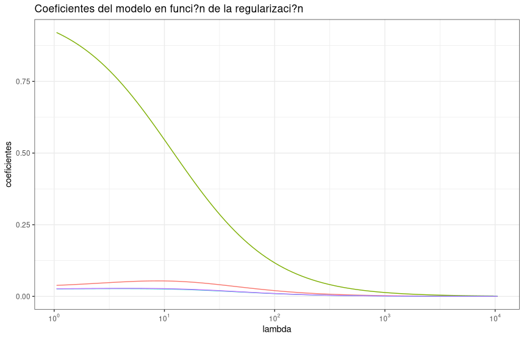
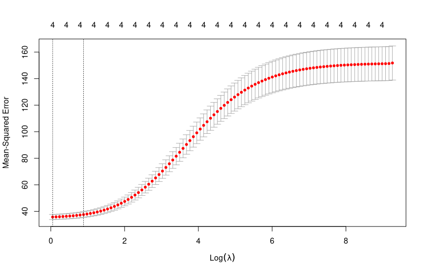
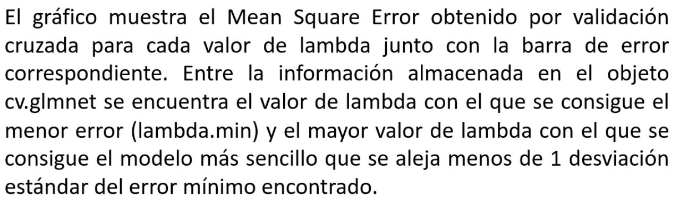

## Regreción lineal multiple

Regularizacion Ridge, Lasso o Elastic Net, fuerzan a que los coeficientes del modelo tiendan a cero, minimizando así el riesgo de overfitting

### Regresión Lasso

Penaliza la suma de cada uno de los $\beta$.

Quedemos buscar un $\lambda$ optimo.
-> nlambda es la cantidad de valores lambda con los que se ensayara. Se recomienda que sea >= 100. Para modelos no lineales se recomienda >1000





```r
# Cambio de nombre
datos<-Clase_3

########### Regresión Lasso #############

# Dividir los datos en 75% para entrenar y 25 % de prueba -> se puede cambiar esta partición
base <- sample(1:nrow(datos), size = 0.75*nrow(datos), replace = FALSE)
datos_train <- datos[base, ]
datos_test  <- datos[-base, ]

# Crear matrices de entrenamiento y prueba

x_train <- model.matrix(Y~., data = datos_train)[, -1] # Covariables
y_train <- datos_train$Y # Variable Dependiente

x_test <- model.matrix(Y~., data = datos_test)[, -1]	#-1 quita la primera columna de la tabla (que es la Y)
y_test <- datos_test$Y

# Creación y entrenamiento del modelo

modelo <- glmnet(
  x           = x_train,
  y           = y_train,
  alpha       = 1,
  nlambda     = 100,
  standardize = TRUE
)
# Evolución de los coeficientes en función de lambda

regularizacion <- modelo$beta %>% 
  as.matrix() %>%
  t() %>% 
  as_tibble() %>%
  mutate(lambda = modelo$lambda)

regularizacion <- regularizacion %>%
  pivot_longer(
    cols = !lambda, 
    names_to = "predictor",
    values_to = "coeficientes"
  )

regularizacion %>%
  ggplot(aes(x = lambda, y = coeficientes, color = predictor)) +
  geom_line() +
  scale_x_log10(
    breaks = trans_breaks("log10", function(x) 10^x),
    labels = trans_format("log10", math_format(10^.x))
  ) +
  labs(title = "Coeficientes del modelo en función de la regularización") +
  theme_bw() +
  theme(legend.position = "none")

```


2 convergen rapido a 0, por lo que no es necesario tenerlas en cuenta.

 ```r
 > cv_error <- cv.glmnet(
+   x      = x_train,
+   y      = y_train,
+   alpha  = 1,
+   nfolds = 10, # Se puede dejar tan grande como la muestra
+   type.measure = "mse",
+   standardize  = TRUE
+ )
> plot(cv_error)
> paste("Lambda encontrado:", cv_error$lambda.min)
[1] "Lambda encontrado: 0.0522872535449215"
 ```
 
 
 
 ```r
 > paste("Lambda óptimo + 1 desviaci?n estándar:", cv_error$lambda.1se)
[1] "Lambda óptimo + 1 desviaci?n estándar: 1.23632657059062" 
 ```
 
 Lambda es el valor con el que se penalizara la regrecion
 
 Ahora con este valor hacemos el modelo final :)
 
 ```r
 # Modelo usando lambda ?ptimo + 1sd

modelo <- glmnet(
  x           = x_train,
  y           = y_train,
  alpha       = 1, # Para la regresi?n Lasso
  lambda      = cv_error$lambda.1se,
  standardize = TRUE
)


# Coeficientes del modelo

df_coeficientes <- coef(modelo) %>%
  as.matrix() %>%
  as_tibble(rownames = "predictor") %>%
  rename(coeficiente = s0)

df_coeficientes %>%
  filter(predictor != "(Intercept)") %>%
  ggplot(aes(x = predictor, y = coeficiente)) +
  geom_col() +
  labs(title = "Coeficientes del modelo Lasso") +
  theme_bw() +
  theme(axis.text.x = element_text(size = 6, angle = 45))

df_coeficientes %>%
  filter(
    predictor != "(Intercept)",
    coeficiente != 0
  ) 
# A tibble: 2 x 2
  predictor coeficiente
  <chr>           <dbl>
1 X2             0.915 
2 X4             0.0355

#Para ver los valores en el gráfico

ylim(0,1) geom_text(aes(label = round(coeficiente,2)), vjust = -0.75)
 ```
 
 
 
 Ahora hacemos los entrenamientos de predicciones
 ```r
 # Predicciones de entrenamiento

predicciones_train <- predict(modelo, newx = x_train)
predicciones_train

> # MSE de entrenamiento
> training_mse <- mean((predicciones_train - y_train)^2)
> paste("Error (mse) de entrenamiento:", training_mse)
[1] "Error (mse) de entrenamiento: 35.909550536656"

# Predicciones de test

predicciones_test <- predict(modelo, newx = x_test)
predicciones_test

> # MSE de test
> test_mse_lasso <- mean((predicciones_test - y_test)^2)
> paste("Error (mse) de test:", test_mse_lasso)
[1] "Error (mse) de test: 35.0347198588562"	#Esto es el error cuadratico medio generado y en teoria es emjor que utilizar el modelo completo
 ```
 
 
 
 ```r
 > #######################################################################
> ######### Regresión Ridge##############################################
> 
> # Matrices de entrenamiento y prueba
> 
> # Crear matrices de entrenamiento y prueba
> 
> x_train <- model.matrix(Y~., data = datos_train)[, -1] # Covariables
> y_train <- datos_train$Y # Variable Dependiente
> 
> x_test <- model.matrix(Y~., data = datos_test)[, -1]
> y_test <- datos_test$Y
>
>
>modelo <- glmnet(
+   x           = x_train,
+   y           = y_train,
+   alpha       = 0,
+   nlambda     = 100,
+   standardize = TRUE
+ )
>
> regularizacion <- modelo$beta %>% 
+   as.matrix() %>%
+   t() %>% 
+   as_tibble() %>%
+   mutate(lambda = modelo$lambda)
> 
> regularizacion <- regularizacion %>%
+   pivot_longer(
+     cols = !lambda, 
+     names_to = "predictor",
+     values_to = "coeficientes"
+   )
> regularizacion %>%
+   ggplot(aes(x = lambda, y = coeficientes, color = predictor)) +
+   geom_line() +
+   scale_x_log10(
+     breaks = trans_breaks("log10", function(x) 10^x),
+     labels = trans_format("log10", math_format(10^.x))
+   ) +
+   labs(title = "Coeficientes del modelo en funci?n de la regularizaci?n") +
+   theme_bw() +
+   theme(legend.position = "none")
 ```
 
 
 
 Ahora la penalizacion empieza antes?
 
 ```r
 > # Evoluci?n del error en funci?n de lambda
> cv_error <- cv.glmnet(
+   x      = x_train,
+   y      = y_train,
+   alpha  = 0,
+   nfolds = 10,
+   type.measure = "mse",
+   standardize  = TRUE
+ )
> 
> plot(cv_error)
 ```
 
 En este caso si se pueden meter variables que tienen colinealidad.
 
 ```r
 > # Mejor valor lambda encontrado
> paste("Lambda encontrado:", cv_error$lambda.min)
[1] "Lambda encontrado: 1.05057275818253"
> # Lambda encontrado + 1sd
> # Mayor valor de lambda con el que el test-error no se aleja m?s de 1sd del m?nimo.
> paste("Mejor valor de lambda encontrado + 1 desviaci?n est?ndar:", cv_error$lambda.1se)
[1] "Mejor valor de lambda encontrado + 1 desviaci?n est?ndar: 2.4269593288832" 
 ```
 
 
 
 
 
 Para los coeficientes del modelo se hace igual que antes 
 
 ```r
 > # MSE de entrenamiento
> training_mse <- mean((predicciones_train - y_train)^2)
> paste("Error (mse) de entrenamiento:", training_mse)
[1] "Error (mse) de entrenamiento: 102.341512014881"
> 
> # Predicciones de test
> predicciones_test <- predict(modelo, newx = x_test)
> 
> # MSE de test
> test_mse_ridge <- mean((predicciones_test - y_test)^2)
> paste("Error (mse) de test:", test_mse_ridge)
[1] "Error (mse) de test: 76.6238473363823"
 ```
 
 
El error enorme es por la particion aleatoria. 


